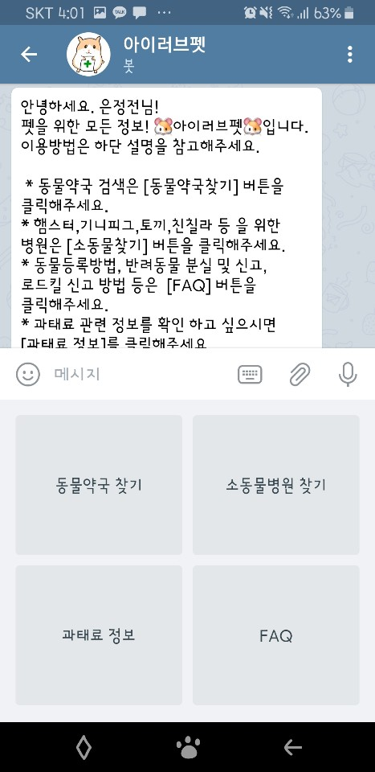
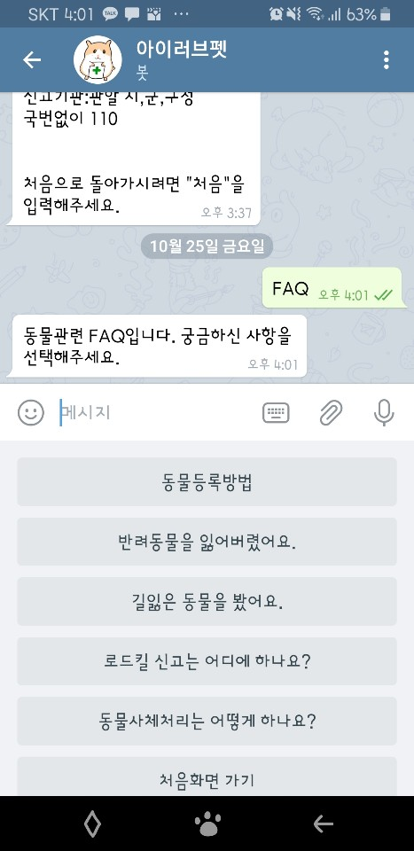

# Introduction
### 반려동물에 대한 정보를 알려주는 텔레그램봇. @iluvpet  
<2019 서울시 인공지능 챗봇톤> 

 

# Requirements
* Google Maps URL scheme
* 서울열린데이터광장-동물약국API
* 리얼소동물 APP data
* 정책공감블로그 데이타
* heroku or ngrok

# Features
주요기능 
* 동물약국 찾기 (자치구별 검색 후 상세정보 제공)
* 소동물병원 찾기
* FAQ
* 과태료 정보

# Version Control
* git 

# Things to do
서울시에 있는 동물약국 데이타가 많아서 무료서버로는 계속돌리기에 무리가 있다. 개선해야함.

# Developer
전은정

